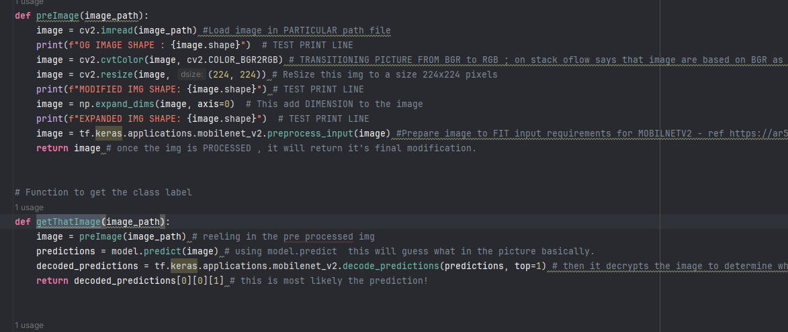

# DOCUMENTATION_6.18.24

Date: April 14, 2024

Features Added/Updated Since Last Update

My images weren't scanning properly with the tf.keras.application.mobilenet_v2 , so i had to do research on how modify the image accordingly to tensor flow standards. 
I used .resize, .cvtcolor and dimension to assist identify the img per modification.  I found a few structures on stackoverflow and did some study on in depth on how things are operated through kera app. 

Issues Encountered
Some of my images i was placing in the main scanner , were not getting scanned accordingly. I had to modify the img to tensorflow .keras .app.mobile.v2 app. I located some resources to help me get an ideal structure til my image was accepted. 

Lessons Learned
I learned this throughout my time at RTC but the console.log during process is so important. It tells me if my images is actually taking effect. In my preimage method you will see each action contains a print line , these are my testers to tell me that its doing what it's doing. Prior to prompting these , i wasn't able to see which was taking in effect. I know i should of taken these in consideration as it is presented to us in class generally but it is all connecting. 

Importance of thorough testing: Since i had issues with my images not being accepted, through testing i learned how accuracy is so important to tensorflow and openCV. It also gave me an insight that sometimes you have to modify certain object for the computer to fully grasp what it is reading. 

Stay up-to-date: I feel like i may have ran my code so many times to make sure things are running accordingly and sometimes another issue tends to pop or there something i want to improve or so on so on. Right now im planning on adding maybe another function that will read an image for it to queue. 

